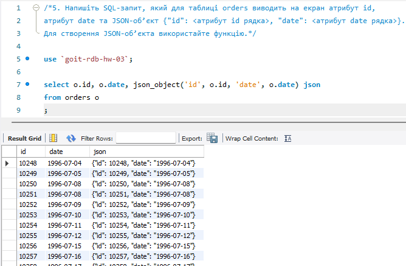

# Домашнє завдання до Теми 5. Вкладені запити. Повторне використання коду

## 1. [Query](./assets/p1_query.sql)

## 2. [Query](./assets/p2_query.sql)

## 3. [Query](./assets/p3_query.sql)

## 4. [Query](./assets/p4_query.sql)

## 5. [Query](./assets/p5_query.sql)

